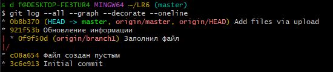
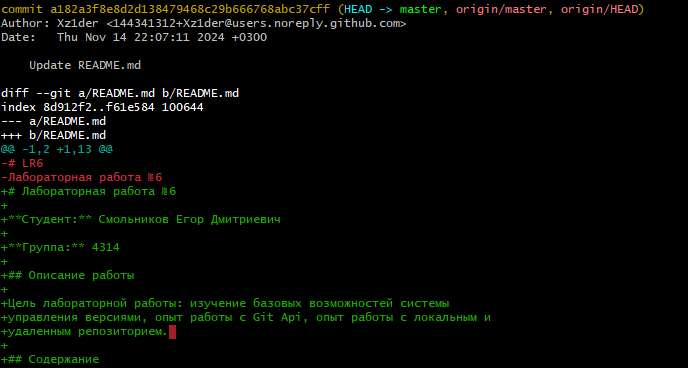
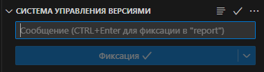
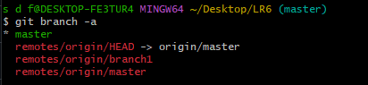
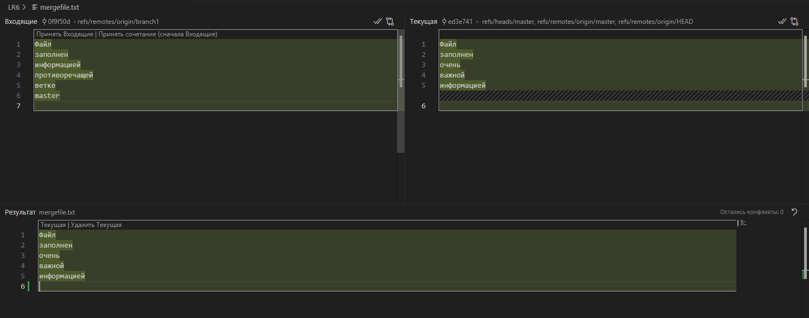
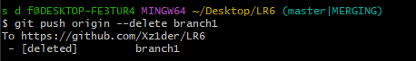
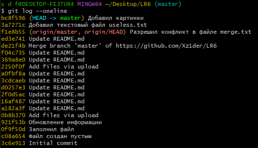
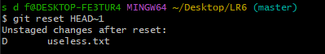
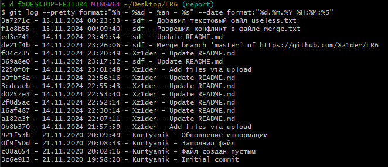

# Лабораторная работа №6

**Студент:** Смольников Егор Дмитриевич

**Группа:** 4314

## Описание работы

Цель лабораторной работы: изучение базовых возможностей системы
управления версиями, опыт работы с Git Api, опыт работы с локальным и
удаленным репозиторием. 
## Содержание
1. [Форк репозитория](README.md#Форк-репозитория-LR6)
2. [Установка Git](README.md#Установка-Git)
3. [Клонирования репозитория](README.md#клонирования-репозитория)
4. [Добавление файла в GitHub и подтягивание изменений](README.md#добавление-файла-в-GitHub-и-подтягивание-изменений)
5. [История операций для каждой из веток](#история-операций-для-каждой-из-веток)
6. [Просмотр последних изменений](#просмотр-последних-изменений)
7. [Создание коммита через специальный редактор - VSCode](#создание-коммита-через-специальный-редактор---vscode)
8. [Слияние веток и разрешение конфликтов](#слияние-веток-и-разрешение-конфликтов)
9. [Удаление побочной ветки](#удаление-побочной-ветки)
10. [Откат коммита](#откат-коммита)
11. [Создание ветки для отчёта](#создание-ветки-для-отчёта)
12. [История операций в отчёте](#история-операций-в-отчёте)
13. [Выводы](#выводы)
## Форк репозитория LR6
1. Переходим на страницу репозитория [LR6](https://github.com/Kurtyanik/LR6/)
2. Нажимаем кнопку "Fork" в правом верхнем углу страницы.

## Установка Git
1. Скачиваем установщик Git
2. Запускаем установщик и следуем инструкциям
3. Настраиваем имя пользователя и email:  

`git config --global user.name "s d f"
git config --global user.email egorsmolnikov22@gmail.com`
## Клонирование репозитория
1. Клонируем репозиторий на локальную машину  
`git clone https://github.com/Xz1der/LR6`  
## Добавление файла в GitHub и подтягивание изменений
1. Нажатием кнопки "Add file" -> "Upload files" добавляем файл в репозиторий 
2. Подтягиваем изменения на локальную машину:  
`git pull`
## История операций для каждой из веток
1. Получил историю коммитов для всех веток с помощью команды:  
`git log --all --graph --decorate --oneline`  

## Просмотр последних изменений 
1. Для просмотра изменений последнегог коммита выполнил:  
`git log -p -1`  
  
2. Для просмотра незафиксированных изменений использовал:  
`git diff`  

## Создание коммита через специальный редактор - VSCode  
1. В VSCode открыл файл README.md и выполнил пару изменений, а затем в разделе "Системы управления версиями" нажал на кнопку фиксации, а также синхронизировал изменения с удалённым репозиторием.

## Слияние веток и разрешение конфликтов  
1. Переключился на ветку мастер
`git checkout master`
2. Вывел список веток, в том числе удалённых
`git branch -a`

3. Слил удалённую ветку origin/branch1 в ветку master:
`git merge origin/branch1`
4. Разрешил конфликт в файле [merge.txt](merge.txt) при помощи VSCode (принял версию из ветки master).

## Удаление побочной ветки  
1. Удалил локальную ветку:
`git branch -d branch1`
2. Удалил удалённую ветку:
`git push origin --delete branch1`

## Откат коммита  
1. Получил историю коммитов:
`git log --oneline`

2. Откатил изменения коммита, добавляющего useless.txt, при помощи reset:
`git reset HEAD~1`

## Создание ветки для отчёта  
1. Создал новую ветку report и переключился на неё:
`git checkout -b report`
2. Перенёс все изображения в папку [Image](Image)
## История операций в отчёте  
1. Получил историю коммитов в форматированном виде и добавил её в отчёт:
`git log --pretty=format:"%h - %ad - %an - %s" --date=format:"%d.%m.%Y %H:%M:%S"`

## Выводы  
В ходе выполнения лабораторной работы №6 освоены основные команды Git и приобретены навыки работы с удалёнными репозиториями на GitHub. Изучены процессы форкования, клонирования, коммитинга, слияния веток, разрешения конфликтов и отката коммитов. Также получен опыт использования графических инструментов, таких как VSCode, для управления версиями. К сожалению, лишь на этапе составления отчёта я заметил, что некоторые коммиты я отправлял с аккаунта "Xz1der", который я создавал ещё на 1 курсе для выполнения неких работ. В следующий раз я буду внимательнее относиться к тому с какого аккаунта отправляются коммиты, чтобы не допускать такой путаницы.
