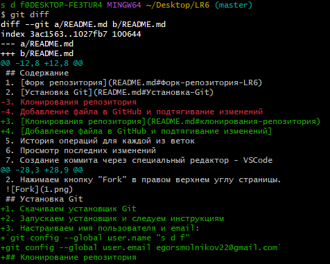

# Лабораторная работа №6

**Студент:** Смольников Егор Дмитриевич

**Группа:** 4314

## Описание работы

Цель лабораторной работы: изучение базовых возможностей системы
управления версиями, опыт работы с Git Api, опыт работы с локальным и
удаленным репозиторием. 
## Содержание
1. [Форк репозитория](README.md#Форк-репозитория-LR6)
2. [Установка Git](README.md#Установка-Git)
3. [Клонирования репозитория](README.md#клонирования-репозитория)
4. [Добавление файла в GitHub и подтягивание изменений](README.md#добавление-файла-в-GitHub-и-подтягивание-изменений)
5. [История операций для каждой из веток](#история-операций-для-каждой-из-веток)
6. Просмотр последних изменений
7. Создание коммита через специальный редактор - VSCode
8. Слияние веток и разрешение конфликтов
9. Удаление побочной ветки
10. Откат коммита
11. Создание ветки для отчёта
12. История операций в отчёте
13. Выводы
## Форк репозитория LR6
1. Переходим на страницу репозитория [LR6](https://github.com/Kurtyanik/LR6/)
2. Нажимаем кнопку "Fork" в правом верхнем углу страницы.

## Установка Git
1. Скачиваем установщик Git
2. Запускаем установщик и следуем инструкциям
3. Настраиваем имя пользователя и email:  

`git config --global user.name "s d f"
git config --global user.email egorsmolnikov22@gmail.com`
## Клонирование репозитория
1. Клонируем репозиторий на локальную машину  
`git clone https://github.com/Xz1der/LR6`  
## Добавление файла в GitHub и подтягивание изменений
1. Нажатием кнопки "Add file" -> "Upload files" добавляем файл в репозиторий 
2. Подтягиваем изменения на локальную машину:  
`git pull`
## История операций для каждой из веток
1. Получил историю коммитов для всех веток с помощью команды:  
`git log --all --graph --decorate --oneline`  

## Просмотр последних изменений 
1. Для просмотра изменений последнегог коммита выполнил:  
`git log -p -1`  
  
2. Для просмотра незафиксированных изменений использовал:  
`git diff`  
