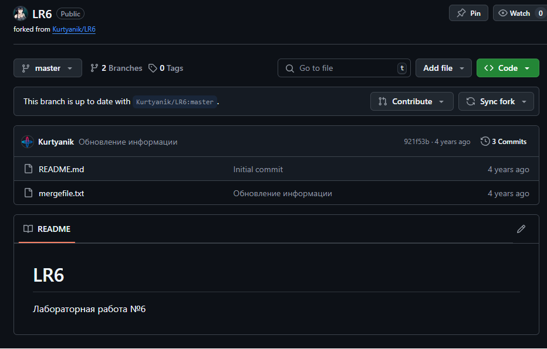

# Лабораторная работа №6

**Студент:** Смольников Егор Дмитриевич

**Группа:** 4314

## Описание работы

Цель лабораторной работы: изучение базовых возможностей системы
управления версиями, опыт работы с Git Api, опыт работы с локальным и
удаленным репозиторием. 
## Содержание
1. [Форк репозитория](README.md#Форк-репозитория-LR6)
2. [Установка Git](README.md#Установка-Git)
3. Клонирования репозитория
4. Добавление файла в GitHub и подтягивание изменений
5. История операций для каждой из веток
6. Просмотр последних изменений
7. Создание коммита через специальный редактор - VSCode
8. Слияние веток и разрешение конфликтов
9. Удаление побочной ветки
10. Откат коммита
11. Создание ветки для отчёта
12. История операций в отчёте
13. Выводы
## Форк репозитория LR6
1. Переходим на страницу репозитория [LR6](https://github.com/Kurtyanik/LR6/)
2. Нажимаем кнопку "Fork" в правом верхнем углу страницы.

## Установка Git
